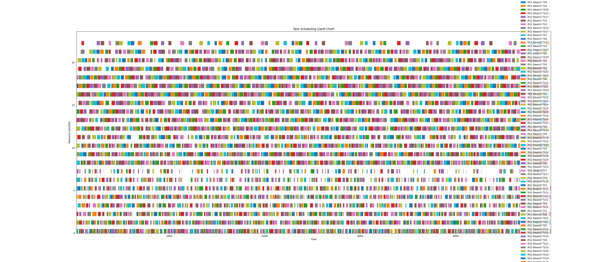
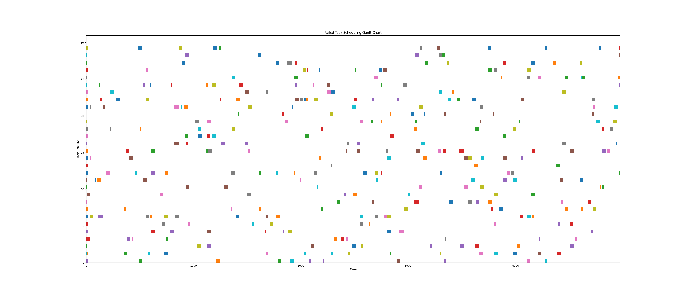

# README

```text
Multisatellite_Task_Scheduling/
│
├── README.md             # 项目说明文件
│
├── requirements.txt      # 项目依赖文件
│
├── config.py             # 配置文件，包含超参数
│
├── utils.py              #
│
├── models/
│   ├── __init__.py
│   ├── resfcn.py         # ResFCN
│   └── ddqn_agent.py       # ddqn智能体定义
│
├── trainers/
│   ├── __init__.py
│   └── ddqn_trainer.py   # 训练器
│
├── simulators/
│   ├── __init__.py
│   ├── Env.py            # 卫星调度环境模拟
│   └── satellite_simulator.py # 卫星任务调度模拟器
│
├── evaluator.py  # 评估
├── main.py     # 训练
│
└──  ...
```

### 环境（Environment）
需要维护以下：
1. **状态空间（State Space）**：最大资源卫星数 x 最大beam数 x schedule_horizon中的grid数量。其中，1表示被占用，0表示空闲。
2. **动作空间（Action Space）**：输出[0,资源卫星数], 表示对当前任务分配的卫星编号，0表示不分配。所以具体调度到哪个 beam 需要根据 limitation 轮询。
4. **奖励函数（Reward Function）**：根据原文中的 reward = 成功调度数 + 优先级 - 切换次数
5. **观察（Observation）**：提供当前状态，以及当前状态下 next task 可调度的部分。
7. **模拟（Simulation）**：卫星的剩余能量、卫星是否处于region中，触发事件。

### 模型（Model）
使用stable-baseline3 DQN

### 模拟器（Simulator）
1. **任务生成**：

task属性：所属task satellite的id；优先级；可执行的时间窗口；执行时间；能耗。

task预先生成，局部贪心：按照开始时间排序，同时开始的按照priority排序。

2. **资源卫星状态**：

维护能量信息，剩余能量和最小能量。

3. **任务卫星状态**：

记录上一次task的调度对象，用于计算switch次数

### TODO
1. 资源卫星进入进出region的事件触发机制

将进入进出包装为一个task，效果是资源卫星离开后，其所有grid被处理为占用状态。

2. 卫星充电问题：

也可以作为一个task放入队列，修改剩余能量。

### Assumption 或 未处理的情况
1. task执行时长 ＜ schedule_horizon
2. 同一个task satellite生成的task可执行窗口不重叠
3. 不可预定义task数量，但可以通过调整task satellite的数量来增加task数量

### 实验结果

目前调度情况可视化：


调度失败的tasks：


实验参数：

- 总时长 2000
- 任务卫星数量 15
- 资源卫星数量 6*4（beams）
- 调度窗口 100
- 滑动步长 40

实验结果：
- Total step:  969 
- Average reward:  6.129514963880289 
- Success rate:  0.9824561403508771 
- Success priority:  5315 / 5405